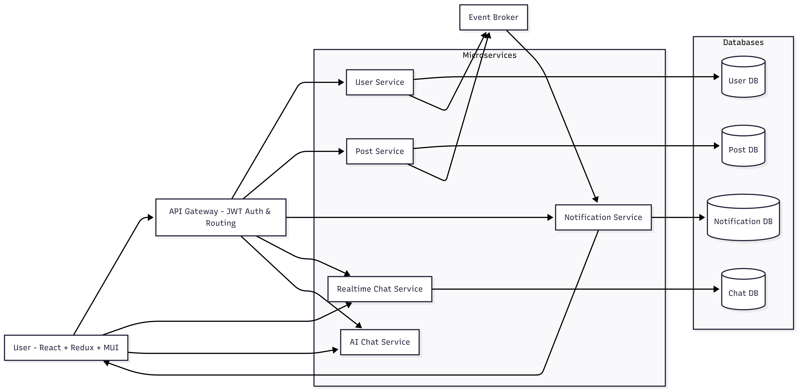

# 📘 Chatbook Application  

Chatbook is a **social media platform** where users can **post, comment, follow, receive notifications, and chat with AI in realtime**.  
Built with **Spring Boot (Backend)** and **React + Redux + MUI (Frontend)**, the app provides a **modern, scalable architecture** for social networking.  

##  Features  

- **User Management**: Registration, login, JWT-based authentication.  
- **Posts & Comments**: Create posts, comment on posts, like posts.  
- **Feed System**: Personalized feed from following users.  
- **Follow/Unfollow**: Connect with other users.  
- **Notifications**: Realtime alerts for likes, comments, follows.  
- **AI Chatbot**: Integrated **OpenAI-powered chatbot** with **SSE streaming** for realtime conversations.  

---

## 🏗️ High-Level Architecture  

 

